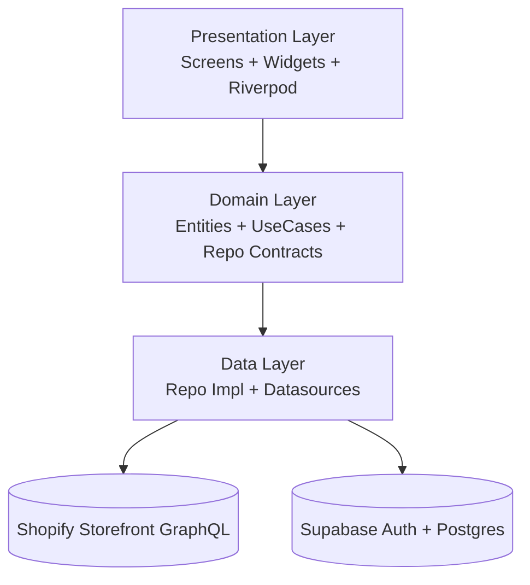
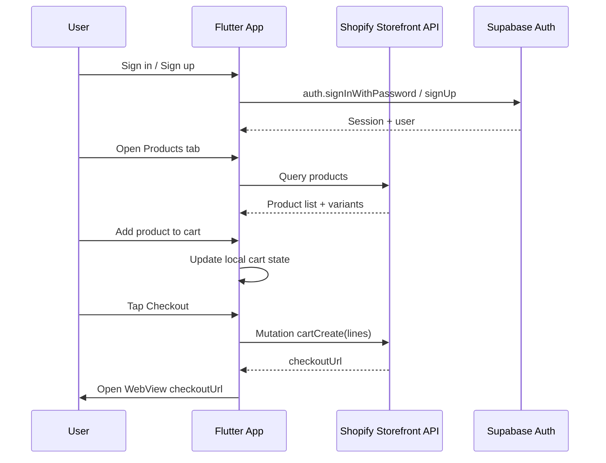

# Shoply Flutter Storefront MVP

A Flutter eCommerce MVP for Android, iOS, and Web that combines:

- Shopify Storefront GraphQL for product catalog and checkout.
- Supabase Auth for sign up/sign in and account state.
- Supabase Postgres schema (migrations included) for app-owned data such as profiles and wishlist.

The goal is to validate the full shopping loop quickly: browse products, open product details, add to cart, and complete checkout.

## Features

### Authentication
- Email/password sign up and sign in.
- Forgot password flow with redirect URL support.
- Auth-based routing guard (`login/register` vs protected app routes).

### Catalog and Product Discovery
- Product list from Shopify Storefront API.
- Product details with image, description, price, and availability.
- Refresh support on listing screens.

### Cart and Checkout
- Local cart state in app with quantity and remove handling.
- Checkout URL creation through Shopify `cartCreate`.
- In-app WebView checkout and post-checkout success detection.

### User Features
- Wishlist state and toggling support.
- Profile view/update via authenticated user metadata.

### Navigation and UX
- Persistent bottom tab navigation with `StatefulShellRoute.indexedStack`.
- Fixed navigation bar while tab content swaps.
- Responsive layout constraints for web and tablet.

## Architecture

The app follows a feature-first Clean Architecture style.

```text
Presentation (UI + state)
  - Screens / Widgets
  - Riverpod providers + notifiers
            |
            v
Domain (business rules)
  - Entities
  - Repository contracts
  - Use cases
            |
            v
Data (integration layer)
  - Datasources (Shopify / Supabase / local)
  - Repository implementations
            |
            v
External services
  - Shopify Storefront GraphQL
  - Supabase Auth + Postgres
```

### Architecture Diagram (Mermaid)



For a standalone copy you can reuse in docs/presentations, see `docs/architecture.md`.

## Main Libraries Used

### State, routing, and app structure
- `flutter_riverpod`: DI + reactive state management.
- `go_router`: declarative routing, guards, and tab shell navigation.

### Backend and networking
- `supabase_flutter`: authentication and Supabase client access.
- `http`: Shopify GraphQL requests.

### UI and platform
- `webview_flutter`: hosted checkout experience.
- `cached_network_image`: efficient product image loading.
- `hive` + `hive_flutter`: lightweight local storage.

### Quality and tooling
- `equatable`: value-based entity/model comparisons.
- `flutter_test` + Riverpod testing patterns for unit/widget tests.

## Project Structure

- `lib/core`: shared config, env handling, router, theme, networking, logging, DI.
- `lib/features`: feature modules (`auth`, `home`, `product`, `products`, `cart`, `checkout`, `wishlist`, `profile`).
- `lib/shared/widgets`: reusable UI pieces (`ProductCard`, `PrimaryButton`, `TabPageScaffold`, etc).
- `supabase/migrations`: SQL schema and policy migrations.
- `scripts`: local run/build helper scripts with safe `--dart-define` loading.
- `.github/workflows`: CI checks for build/test flows.

## Environment and Secrets

Use runtime defines from `.env` through scripts (never commit real credentials):

1. Copy template:
   - `cp .env.example .env`
2. Fill values:
   - `SHOPIFY_DOMAIN`
   - `SHOPIFY_STOREFRONT_TOKEN`
   - `SUPABASE_URL`
   - `SUPABASE_ANON_KEY` (publishable/anon key)
   - Optional: `SUPABASE_EMAIL_REDIRECT`

`.env` is ignored by git; `.env.example` is tracked.

## Setup

1. Clone and enter project:
   - `git clone <your-repo-url>`
   - `cd shopify_supabase_store`
2. Install dependencies:
   - `flutter pub get`
3. Configure environment:
   - `cp .env.example .env`
4. Run SQL migration in Supabase SQL editor:
   - `supabase/migrations/001_initial_schema.sql`
5. Start app:
   - Mobile/device: `bash scripts/run_dev.sh -d <device_id>`
   - Web/Chrome: `bash scripts/run_dev.sh -d chrome`

## Build Commands

- Web release:
  - `bash scripts/build_web.sh`
- Android APK release:
  - `bash scripts/build_apk.sh`

These scripts load `.env` and pass values via `--dart-define`.

## Database Notes (Supabase)

- Auth users are stored in `auth.users` (Supabase Authentication panel).
- App tables are in `public` schema (for example `profiles`, `wishlist`, etc, depending on migration applied).
- If `public` tables are empty, verify the migration has been executed in your target Supabase project.

## API Flow (Sequence)

The main commerce path:



Flow summary:
- Product catalog and checkout URL are fetched from Shopify Storefront API.
- Authentication state comes from Supabase Auth.
- Protected routes are controlled by auth state in router redirect logic.

## Testing

- Run all tests:
  - `flutter test`
- Existing tests focus on core use cases and provider/notifier behavior.

## Screenshots and Demo Media

Add product shots or short gifs under `docs/assets/` and link them here.

Recommended captures:
- Home product grid.
- Product detail with Add to Cart.
- Cart with checkout button.
- Checkout WebView.
- Login / Register / Profile pages.

Example markdown once files are added:

```md


```

## Known Limitations and Next Steps

- Expand integration coverage for auth + checkout success callbacks.
- Migrate cart persistence from in-memory to remote-first with offline fallback.
- Add telemetry/analytics and error reporting.
- Improve profile/wishlist sync consistency across sessions/devices.
- Add webhook-based order sync and admin merchandising blocks.
