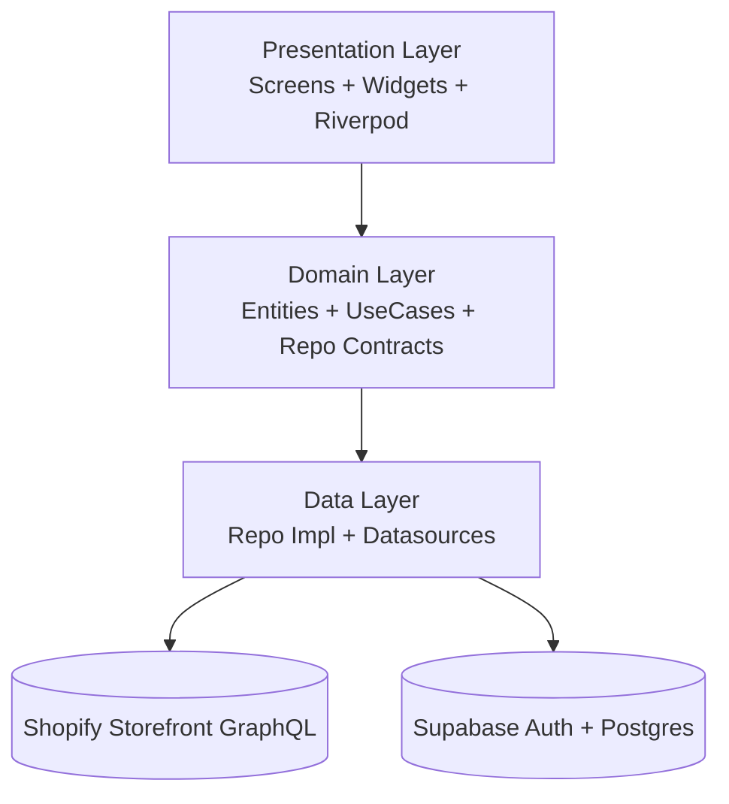
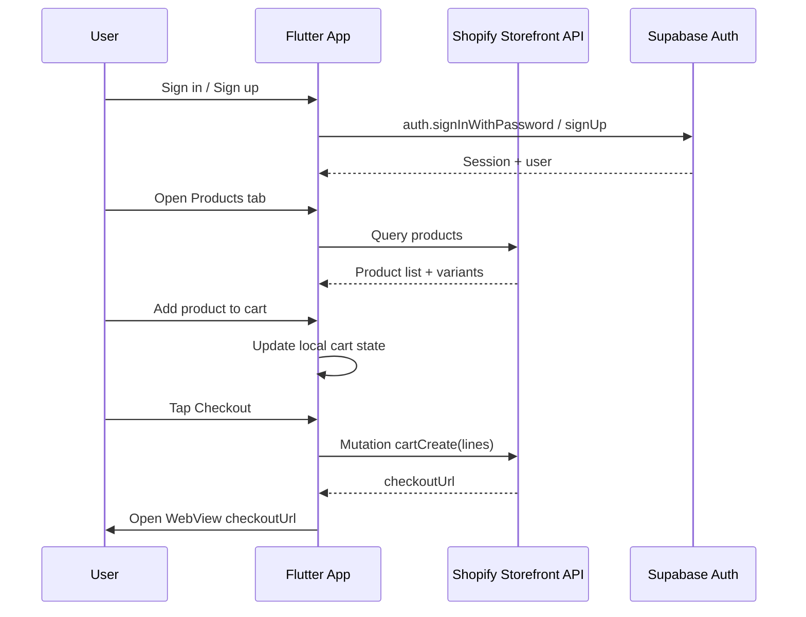

# Architecture Reference

This file contains reusable architecture artifacts for docs, PRs, and presentations.

## Layer Diagram

```mermaid
flowchart TD
  UI[Presentation Layer<br/>Screens + Widgets + Riverpod]
  Domain[Domain Layer<br/>Entities + UseCases + Repo Contracts]
  Data[Data Layer<br/>Repo Impl + Datasources]
  Shopify[(Shopify Storefront GraphQL)]
  Supabase[(Supabase Auth + Postgres)]

  UI --> Domain
  Domain --> Data
  Data --> Shopify
  Data --> Supabase
```

## Commerce Sequence

```mermaid
sequenceDiagram
  participant User
  participant App as Flutter App
  participant Shop as Shopify Storefront API
  participant Supa as Supabase Auth

  User->>App: Sign in / Sign up
  App->>Supa: auth.signInWithPassword / signUp
  Supa-->>App: Session + user

  User->>App: Open Products tab
  App->>Shop: Query products
  Shop-->>App: Product list + variants

  User->>App: Add product to cart
  App->>App: Update local cart state

  User->>App: Tap Checkout
  App->>Shop: Mutation cartCreate(lines)
  Shop-->>App: checkoutUrl
  App->>User: Open WebView checkoutUrl
```
